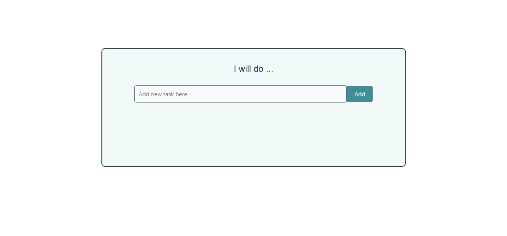
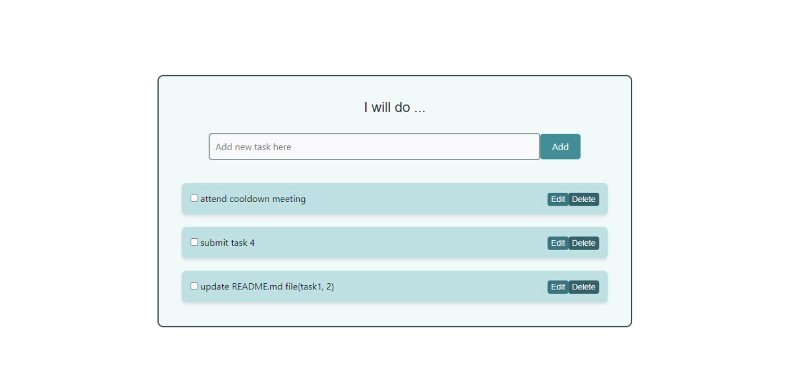
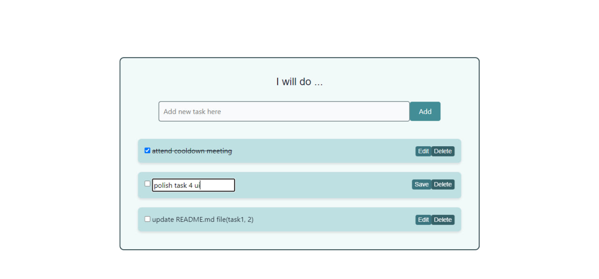
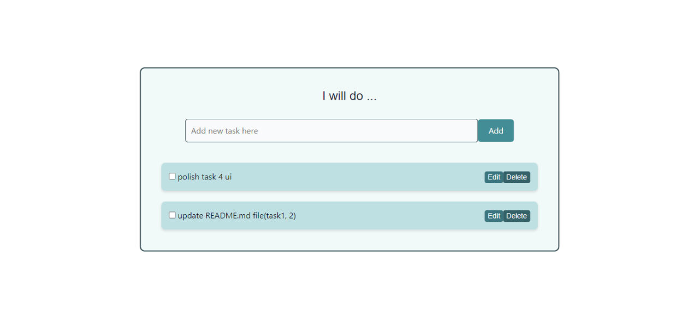

<<<<<<< HEAD
# To do list app with react

# To-do List App

# Adding a Task

# mark task as done

# edit a task

# delete a task

=======
# To Do app

# Add tasks

# Mark task as done

# edit task

# delete task

>>>>>>> 228c64ec5aef565a0b138627390952b8e8c96d82
